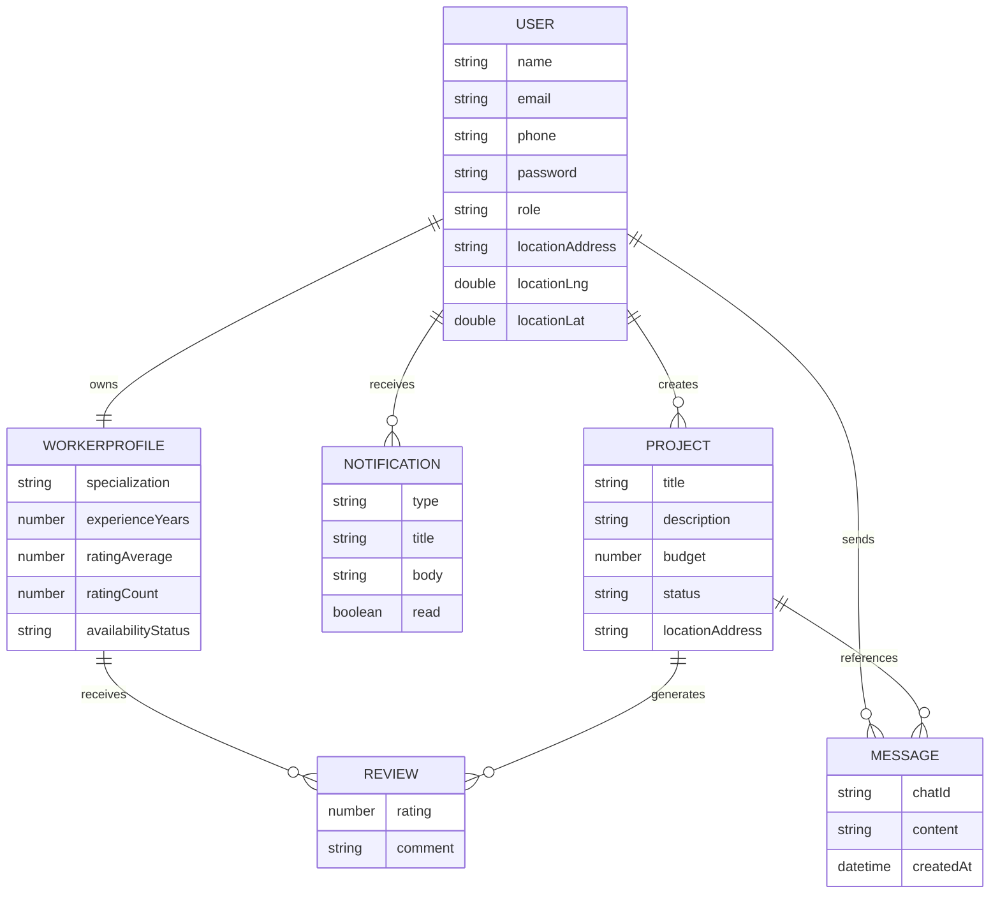

# SmartWorker Connect ERD

```mermaid
erDiagram
    USER ||--o{ PROJECT : creates
    USER ||--o{ MESSAGE : sends
    USER ||--o{ NOTIFICATION : receives
    USER ||--|| WORKERPROFILE : owns
    WORKERPROFILE ||--o{ REVIEW : receives
    PROJECT ||--o{ REVIEW : generates
    PROJECT ||--o{ MESSAGE : references

    USER {
      string name
      string email
      string phone
      string password
      string role
      string locationAddress
      double locationLng
      double locationLat
    }

    WORKERPROFILE {
      string specialization
      number experienceYears
      number ratingAverage
      number ratingCount
      string availabilityStatus
    }

    PROJECT {
      string title
      string description
      number budget
      string status
      string locationAddress
    }

    REVIEW {
      number rating
      string comment
    }

    MESSAGE {
      string chatId
      string content
      datetime createdAt
    }

    NOTIFICATION {
      string type
      string title
      string body
      boolean read
    }
```
